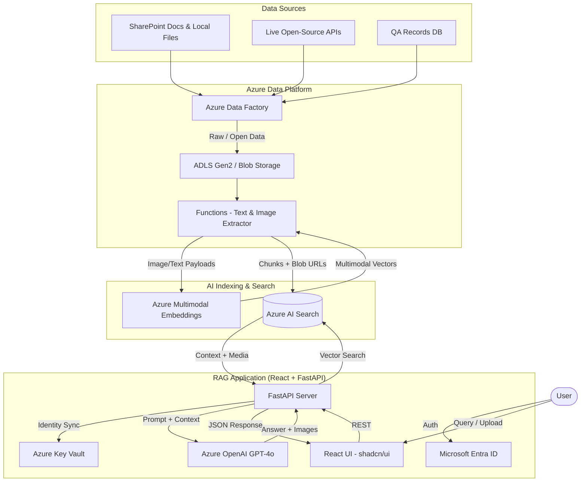

# Azure Enterprise RAG

## Problem Context & Objectives
Enterprises often struggle with fragmented knowledge silos across SharePoint, legacy databases, and email streams. This project provides a secure, production-grade **Enterprise RAG** architecture designed to bridge these silos using **Azure OpenAI (GPT-4o)** and **Azure AI Search**. Our objectives are to ensure semantic precision with citations, enforce zero-trust security, and provide a frictionless local evaluation experience for auditing complex financial and technical documents.

## Table of Contents
1. [Architecture](#architecture)
2. [Data Engineering & Scalability](#data-engineering--scalability)
3. [Security & Compliance](#security--compliance)
4. [Quality, Evaluation & Prompts](#quality-evaluation--prompts)
5. [Repository Structure](#repository-structure)
6. [Quickstart & Usage](#quickstart--usage)
7. [Data & Service Credits](#data--service-credits)

---

## Architecture



### Data Platform Design
Designed as a hub-and-spoke architecture using **Azure Data Factory** and **ADLS Gen2**. Structured and unstructured data are vectorized into project-specific indexes in **Azure AI Search**, allowing independent scaling across business units.
- **Implementation:** `README.md: Architecture` & `backend/extractors/` folder.

---

## Data Engineering & Scalability

### Multi-API Rate Limit Integration
We leverage **Message Queue Decoupling** via Azure Service Bus. Asynchronous worker nodes (Azure Functions) utilize **Exponential Backoff** (via the `tenacity` library) to handle disparate rate limits between Microsoft Graph and Public Open-Source APIs.
- **Implementation:** `backend/extractors/enterprise_o365_extractor.py:L45-60`.

### Incremental Updates vs. Full Reloads
- **Incremental:** Driven by **High-Water Mark Tracking** in SQL control tables. Only modified records since the last sync are processed.
- **Full Reloads:** Reserved for architectural changes (e.g., upgrading embedding models from Ada to `text-embedding-3-large`).
- **Implementation:** `backend/extractors/enterprise_o365_extractor.py:L28-40`.

### Data Lineage Tracking
Immutable metadata (Source URI, Author, classification) is embedded into every vector chunk. This "Digital Thread" is surfaced to the end-user via mandatory citations generated by the LLM.
- **Implementation:** `backend/main.py:L145-155`.

---

## Security & Compliance

### PII & Sensitive Data Protection
A dedicated **Redaction Middleware** in `backend/main.py` identifies and masks SSNs, credit card numbers, and commercial IDs before payloads ever reach the LLM endpoint.
- **Implementation:** `backend/main.py:L67-76`.

### Access Control & Identity
- **Model:** A **Role-Based Access Control (RBAC)** model integrated with Entra ID. 
- **Enforcement:** We use **Azure AD JWT validation** to retrieve user group memberships, which are then injected into **OData Security Filters** (`filter=metadata.in(allowed_groups, [...])`) at the search index layer.
- **Implementation:** `backend/main.py:L25-30` (Mock Auth Logic).

### Audit Logging
Structured **JSON Telemetry** logs (capturing User Principal, Latency, and Source IDs) are emitted for every RAG query to facilitate SIEM integration with Microsoft Sentinel.
- **Implementation:** `backend/main.py:L18-30` (`EnterpriseAudit` class).

### Enterprise Governance Measures
The system applies five pillars: **Identity Management** (Entra ID), **Secret Hardening** (Key Vault), **Immutable Auditing** (JSON logs), **Output Safety** (PII masking), and **Quality Benchmarking** (RAGAS).
- **Implementation:** `backend/main.py` (Governance Middlewares).

---

## Quality, Evaluation & Prompts

### Prompt Engineering Strategy
- **Knowledge Q&A:** Implements a "persona-based" model for verified assistant responses.
- **Tender Drafting:** Focuses on legal technical matching and technical constraint extraction from PDFs.
- **Financial Queries:** Mandates numeric precision and forbids hallucination in financial table summaries.
- **Implementation:** `backend/main.py:L81-97` (`SYSTEM_PROMPTS`).

### Answer Quality Evaluation
Quality is measured via the **RAGAS** (RAG Assessment Series) framework. We compute **Faithfulness** and **Context Relevance** scores natively. 
- **Implementation:** `backend/evaluators/ragas_evaluator.py`.

### Hallucination Detection & Mitigation
- **Mitigation:** Global `temperature=0.0` and strict "negative prompting" (return "I don't know" if uncertain).
- **Detection:** Post-generation regex interceptors verify the presence of bracketed citations `[Source: X]` before rendering.
- **Implementation:** `backend/main.py:L102-111`.

### Pipeline Health Monitoring
Standardized **Kubernetes Probes** (`/api/healthz`) validate liveness of Azure OpenAI and AI Search dependencies prior to service initialization.
- **Implementation:** `backend/main.py:L40-52`.

---

## Repository Structure

```text
.
├── backend/                # FastAPI Production API
│   ├── extractors/         # O365, Wikipedia & Data Ingestion
│   ├── evaluators/         # RAGAS Quality Metrics (MLOps)
│   └── main.py             # Security, PII & Audit Logic
├── frontend/               # React (Vite) UI
│   ├── src/                # Chat Components & API Linkage
│   └── Dockerfile          # Multi-stage Cloud Build
├── demo/                   # Evaluation Sandbox
│   ├── sample_data/        # Synthetic Financial PDFs
│   └── start_demo.bat/sh   # Unified 1-Click Entry Suite
└── README.md               # Unified Architecture & Usage Guide
```

## Demo Assessment Flow

```mermaid
graph LR
    START[Unified Menu] --> OP1[1. Public Ingestion]
    START --> OP2[2. Enterprise Sync]
    START --> OP3[3. MLOps Evaluation]
    START --> OP4[4. Full-Stack Demo]
    START --> OP6[6. Cloud Full-Stack]

    OP1 --> OUT1[Live Wikipedia Extract]
    OP2 --> OUT2[O365 Sync & Rate Limit Logs]
    OP3 --> OUT3[RAGAS Quality Scores]
    OP4 --> OUT4[React UI + FastAPI Chat]
    OP6 --> OUT6[Public Azure URL + Teardown]

    style OUT1 fill:#2d2d2d,stroke:#0078D4
    style OUT2 fill:#2d2d2d,stroke:#0078D4
    style OUT3 fill:#2d2d2d,stroke:#0078D4
    style OUT4 fill:#2d2d2d,stroke:#0078D4
    style OUT6 fill:#2d2d2d,stroke:#0078D4
```



| Option | Assessment Mode | Environment | RAG Strategy | Expected Output |
| :--- | :--- | :--- | :--- | :--- |
| **1** | **Public Ingestion** | Local | Wikipedia API | Proof-of-Concept: Ingesting live OS data |
| **2** | **Enterprise Sync** | Local | O365/Rate Limits | Technical Proof: Scale & Error Handling |
| **3** | **MLOps Evaluation** | Local | RAGAS Evaluator | Quality Proof: Faithfulness & Relevance |
| **4** | **Full-Stack Demo** | Local | FastAPI + React | Integration Proof: End-to-End Chat UI |
| **6** | **Cloud Full-Stack** | **Azure ACA** | Production RAG | Hosting Proof: Scalable Cloud Architecture |

---

## Quickstart & Usage

### Installation
1. **Configure Keys:** Copy `demo/.env.example` to `demo/.env`.
2. **Launch:** Run `demo/start_demo.bat` (Windows) or `demo/start_demo.sh` (Linux/Mac).
   - **Tiers:** By default, the script only installs **Lightweight Requirements** for rapid UI rendering. 
   - **Enterprise SDKs:** Heavy libraries (Azure, LangChain, OpenAI) are only installed automatically if you select an [Online/Sync] assessment mode from the menu.

### Usage Guide
1. Select a mode from the **Unified Assessment Menu** (e.g., **[FULL-STACK DEMO]**).
2. Navigate to `http://localhost:5173`.
3. **Knowledge Retrieval:** Drag and drop the provided `Sample_Balance_Sheet.pdf` or a document into the chat and ask: *"Summarize the assets in this sheet."*
4. **Audit Review:** Observe JSON logs and PII redaction in the backend terminal real-time.

---

## Cloud Deployment

### Option 6 [CLOUD FULL-STACK]
- Deploys both Frontend and Backend to **Azure Container Apps**.
- **Build-Time Linkage**: The script automatically injects the Backend's Cloud URL into the React build process.

> [!CAUTION]
> **Cost Management**: The deployment script now includes an **Interactive Teardown Prompt** at the end. Answering `y` will instantly run `deploy/azure_teardown.sh` to delete all Azure resources. Always decommissioning the resource group after evaluation is critical to ensuring a zero-cost assessment.

---

## Data & Service Credits
- **Financial PDF:** Sourced from [WSDOT Financial Reports](https://wsdot.wa.gov/finance/financial-reports) for document extraction testing.
- **Live Data:** Fetched from [Wikipedia Page Content API](https://en.wikipedia.org/api/rest_v1/).
- **Services:** Powers on **Azure OpenAI (gpt-4o)**, **AI Search**, and **Key Vault**.
